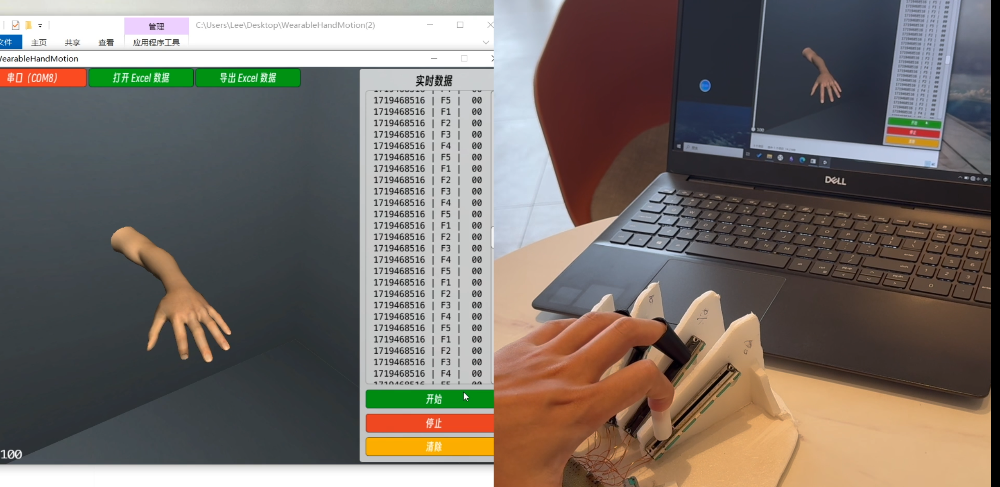
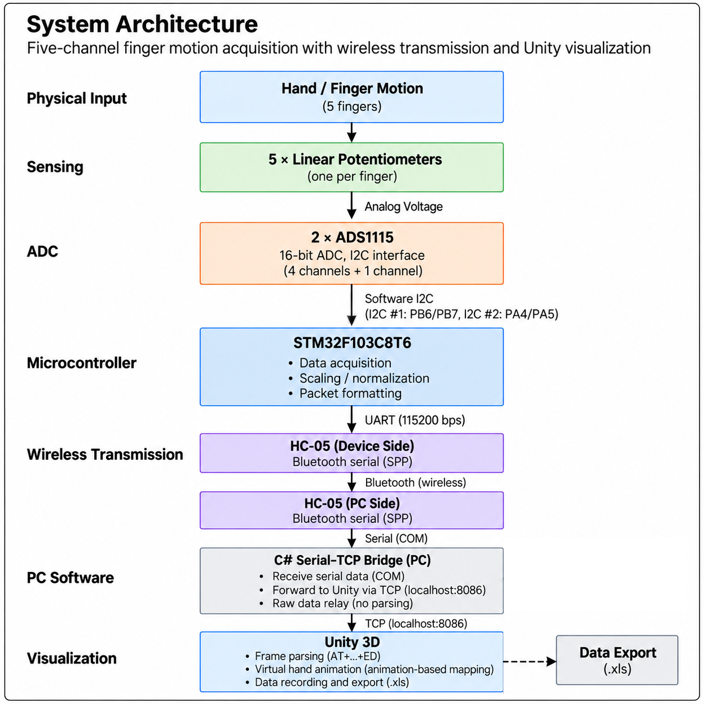
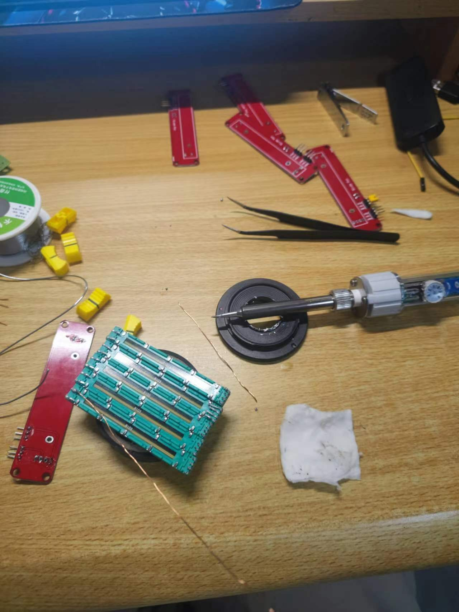
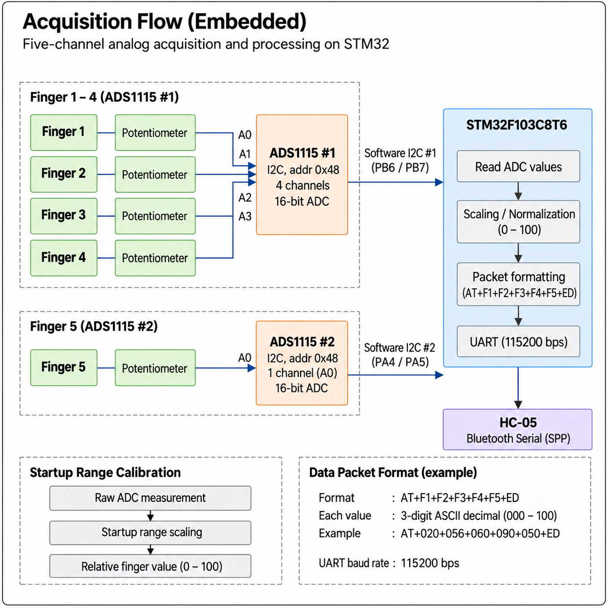
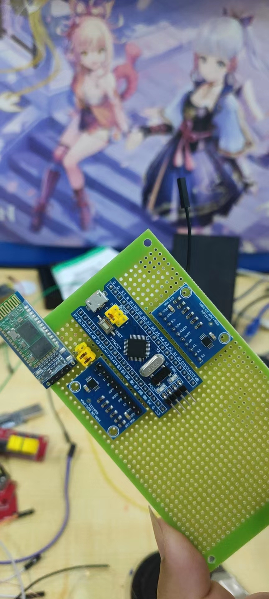
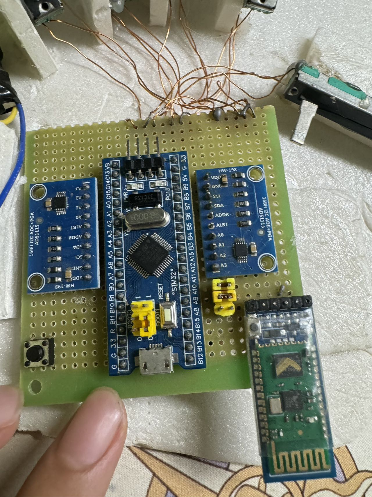
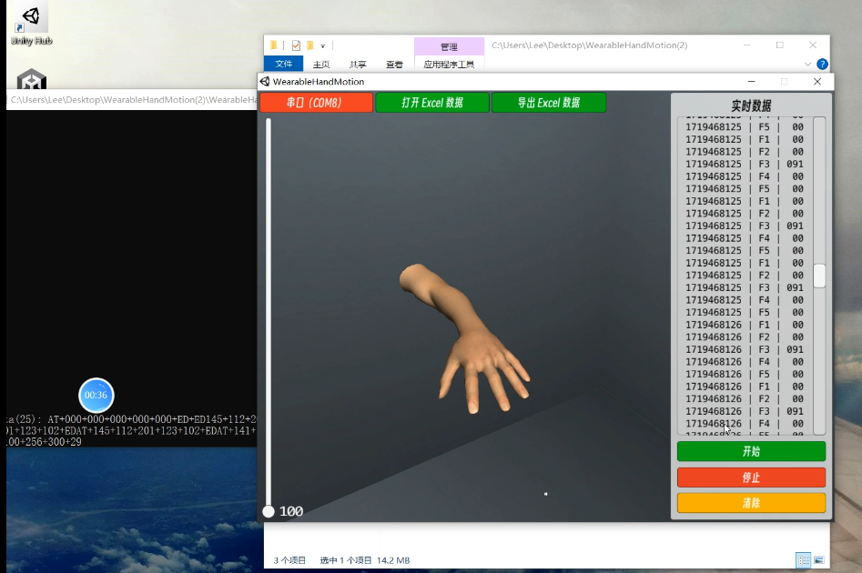
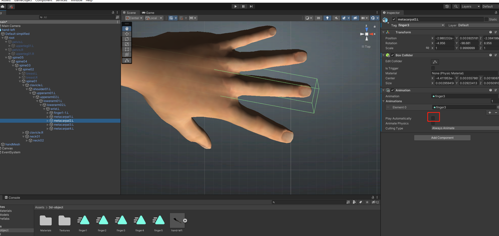

# Wireless Gesture Acquisition & Unity Visualization

<p align="center">
  
</p>

A five-channel finger-motion acquisition system that converts physical finger movement into analog sensor signals, digitizes them using dual ADS1115 ADCs, processes the measurements on an STM32F103C8T6, and transmits the resulting data wirelessly for PC-side visualization.

The project integrates physical sensing, embedded data acquisition, Bluetooth serial communication, PC-side data transfer, virtual-hand visualization, and motion-data recording into a complete end-to-end prototype.

**Project period:** Jan 2023 – Nov 2023  
**Institution:** Jinan University  
**Project type:** Undergraduate Thesis

---

## Project Goal

The project explored a low-cost approach to acquiring finger-motion data for human-machine interaction.

Instead of using camera-based tracking or a high-degree-of-freedom sensor glove, the system uses one linear potentiometer for each finger to convert physical finger displacement into an analog voltage.

The resulting five-channel sensor data is digitized, processed by an embedded controller, transmitted wirelessly, and mapped to a virtual hand for real-time visualization.

The goal was therefore not to build a machine-learning gesture-recognition system, but to develop a complete **finger-motion acquisition and visualization pipeline** from physical sensing to PC-side presentation.

---

## Highlights

- **5 independent finger-motion sensing channels**
- **5 × linear potentiometers** for finger displacement sensing
- **2 × ADS1115 16-bit ADCs** for five-channel analog acquisition
- `STM32F103C8T6` embedded processing
- Two independent software-I2C buses
- HC-05 Bluetooth serial communication
- Five-channel ASCII packet transmission at **115200 baud**
- PC-side serial-to-TCP data bridge
- Unity-based virtual-hand visualization
- Sensor-data recording and `.xls` export
- Complete physical prototype with live hand-motion demonstration

---

## My Contributions

My work focused primarily on the physical sensing, embedded acquisition, wireless communication, and overall system-integration portions of the project.

- Designed the overall five-channel finger-motion acquisition concept.
- Built and integrated the sensing mechanism using one linear potentiometer per finger.
- Integrated two ADS1115 ADC modules with an `STM32F103C8T6` for five-channel analog acquisition.
- Implemented the STM32-side acquisition logic, channel sequencing, relative-value scaling, and UART packet transmission.
- Integrated two software-I2C buses for communication with the ADC modules.
- Configured and integrated the HC-05 Bluetooth serial link between the acquisition device and the PC side.
- Defined the sensing-to-visualization system concept and integrated the embedded data pipeline with the PC-side visualization workflow.
- Tested the complete system through live finger-motion demonstrations and recorded acquisition data.

> **Contribution boundary:** The PC-side C# / Unity visualization implementation was adapted from existing code rather than written entirely from scratch. My contribution on the visualization side focused on the system concept, data integration, configuration, and end-to-end operation rather than independent C# software development.

---

## System Architecture

<p align="center">
  
</p>

The complete system connects five physical sensing channels to an embedded controller and then to a PC-side visualization pipeline.

```text
Finger Motion
      ↓
5 × Linear Potentiometers
      ↓
2 × ADS1115
      ↓
STM32F103C8T6
      ↓
HC-05 Bluetooth Link
      ↓
PC Serial / TCP Bridge
      ↓
Unity Visualization
```

Each stage serves a separate function:

- the potentiometers convert physical displacement into analog voltage;
- the ADS1115 modules digitize the five analog channels;
- the STM32 acquires, scales, and packages the measurements;
- the HC-05 modules provide the wireless serial link;
- the PC-side bridge transports the incoming stream to Unity;
- Unity parses the finger values and maps them to virtual-hand animation states.

---

## Physical Sensing Concept

Each finger is mechanically coupled to a linear potentiometer.

As the finger moves, the sensing mechanism changes the slider position of the potentiometer, producing an analog voltage associated with that finger's displacement.

<p align="center">
  
</p>

Using one sensing element per finger creates five independent motion channels:

```text
Finger 1 → Sensor Channel 1
Finger 2 → Sensor Channel 2
Finger 3 → Sensor Channel 3
Finger 4 → Sensor Channel 4
Finger 5 → Sensor Channel 5
```

This architecture intentionally represents each finger using **one overall motion value**.

It does not attempt to measure every individual finger joint independently.

---

## Embedded Acquisition

<p align="center">
  
</p>

The five analog sensing channels are acquired using two ADS1115 ADC modules.

- **ADS1115 #1** acquires four sensor channels.
- **ADS1115 #2** acquires the fifth sensor channel.
- Both ADCs communicate with the STM32 through separate software-I2C buses.
- Software-I2C #1 uses `PB6 / PB7`.
- Software-I2C #2 uses `PA4 / PA5`.
- The STM32 cycles through the five sensor channels and maintains the latest value for each finger.

Using two independent I2C buses also allows the two ADS1115 modules to operate independently even though the preserved implementation uses the same 7-bit device address.

### Controller Hardware

<p align="center">
  
</p>

The prototype controller integrates:

- `STM32F103C8T6`
- 2 × ADS1115 modules
- HC-05 Bluetooth module
- sensor connections
- supporting prototype wiring and interfaces

### Hardware Integration

<p align="center">
  
</p>

The controller was installed directly into the physical sensing assembly and connected to the five potentiometer channels.

This stage combined the mechanical sensing structure, ADC modules, MCU, Bluetooth communication, and wiring into one working acquisition device.

---

## Sensor Scaling

Absolute sensor values are not ideal for describing finger state because physical travel depends on the sensing mechanism and user geometry.

The project therefore converted the measured sensor values into a relative finger-state representation.

The preserved firmware uses a simplified startup-range scaling approach:

```text
Establish startup range
        ↓
Read ADC measurement
        ↓
Apply shared range scaling
        ↓
Relative finger value
(nominal 0–100)
```

This relative representation was then used for both wireless transmission and PC-side visualization.

> **Implementation note:** The thesis described a more general travel-calibration concept intended to compensate for differences between users and fingers. The preserved firmware version uses a simpler shared startup-range implementation rather than independent minimum/maximum calibration parameters for all five fingers.

---

## Data Packet Format

After acquisition and scaling, the STM32 packages the latest five finger values into a simple ASCII data frame.

The preserved firmware uses the format:

```text
AT+F1+F2+F3+F4+F5+ED
```

Each finger value is represented as a three-digit decimal field.

Example:

```text
AT+020+056+060+090+050+ED
```

Conceptually:

```text
AT
 │
 ├── +020   Finger 1
 ├── +056   Finger 2
 ├── +060   Finger 3
 ├── +090   Finger 4
 ├── +050   Finger 5
 │
 ED
```

The UART communication rate used by the preserved firmware is:

```text
115200 baud
```

A text-based packet format made the transmitted data straightforward to inspect during development and simple to parse on the PC side.

---

## Wireless Communication

The acquisition device communicates with the PC through an HC-05 Bluetooth serial link.

Two HC-05 modules were configured as a paired serial connection:

```text
STM32
  ↓ UART
HC-05
(Device Side)
  ↓
Bluetooth
  ↓
HC-05
(PC Side)
  ↓
Serial / COM
```

This allowed the sensing device to operate physically separated from the visualization computer while preserving a conventional serial-data interface.

---

## PC Data Pipeline

On the PC side, the Bluetooth data appears as a serial COM stream.

A lightweight C# bridge relays the incoming serial data to a local TCP connection:

```text
Bluetooth Serial
      ↓
COM Port
      ↓
C# Serial–TCP Bridge
      ↓
TCP localhost:8086
      ↓
Unity Application
```

The bridge primarily acts as a transport layer.

It forwards the raw serial stream rather than performing the finger-value visualization itself.

Frame parsing and visualization occur downstream in the Unity application.

---

## Unity Visualization

<p align="center">
  
</p>

The Unity application displays a virtual hand whose five fingers can be controlled independently from the incoming sensor values.

The visualization does **not** calculate full skeletal joint angles or perform inverse kinematics.

Instead, five finger animations were prepared in advance, covering motion between extended and flexed states.

The incoming relative finger value is then mapped to a position within the corresponding animation.

Conceptually:

```text
Finger value
    ↓
Select corresponding finger animation
    ↓
Set animation playback position
    ↓
Display virtual finger state
```

### Animation Setup

<p align="center">
  
</p>

The implementation uses Unity animation `normalizedTime` to select the displayed state of each finger animation.

This provides an intuitive visual representation of the five-channel sensor data without requiring a full hand-kinematics model.

> **Contribution boundary:** The C# animation-mapping implementation was adapted from existing code. It is included here to explain how the integrated system operated, not as independently authored software work.

---

## Data Recording

The Unity-side application also supports recording the received finger-state data and exporting it to an `.xls` file.

The recorded data can therefore be used separately from the live visualization pipeline.

This gives the prototype two related functions:

```text
Live Acquisition
      ↓
Virtual-Hand Visualization
```

and

```text
Finger-Motion Acquisition
      ↓
Recorded Sensor Data
      ↓
Later Analysis / Reuse
```

The exported data preserves the measured finger states during a demonstration session.

---

## Demo & Results

### Live Demonstration

[▶ Watch the gesture-acquisition demo](demo/gesture-demo.mp4)

The demonstration shows physical finger movement on the sensing device being reflected by the virtual hand on the PC.

The system was tested with multiple hand configurations and gesture sequences to verify that independent finger movements could be captured, transmitted, and visualized.

The original thesis demonstration included several example configurations, including:

- pinch;
- a "six" hand gesture;
- "LOVE";
- a closed-hand gesture.

These demonstrations were used to show the behavior of the acquisition and visualization pipeline rather than to demonstrate a machine-learning gesture classifier.

---

## Engineering Limitations & Lessons

### 1. Five-Channel Finger Representation

Each finger is represented by one overall motion value.

A real finger contains multiple joints with different motion states, so the system cannot reconstruct detailed joint-level hand pose.

A higher-resolution system could use multiple sensors per finger to capture individual joint motion.

### 2. Animation-Based Visualization

The Unity visualization maps sensor values to positions within predefined animations.

This is simpler than directly controlling the individual bones of a skeletal model, but it also limits the flexibility and fidelity of the visualization.

A future implementation could directly map calibrated sensor data to joint rotations.

### 3. Shared Startup Scaling

The thesis explored a more general travel-normalization method to compensate for differences in finger and hand size.

The preserved firmware implements a simpler shared startup-range scaling method.

A future firmware revision could maintain independent calibration parameters for each sensing channel.

### 4. Prototype-Focused Firmware

The preserved embedded firmware was developed to validate the complete acquisition pipeline rather than to optimize sampling rate, latency, or production-level firmware architecture.

A future implementation could use timer-driven acquisition, structured buffers, explicit range checking, and independent per-channel calibration.

---

## Repository Scope

This repository is intended as an **engineering portfolio and technical case study**, not as a complete open-source hardware or software release.

The following materials are intentionally not published:

- the complete original STM32 firmware project;
- third-party STM32 peripheral-library code;
- third-party software-I2C driver implementations;
- the complete Unity project;
- C# visualization code that was adapted from existing implementations;
- the full undergraduate-thesis development archive;
- external reference materials and third-party libraries.

The materials published here are intended to demonstrate the physical sensing architecture, embedded acquisition pipeline, wireless communication, system integration, testing, and final prototype.

---

## Acknowledgments

This project was developed as an undergraduate thesis project at **Jinan University**.

I am grateful to my thesis advisor and to the authors of the external software resources used during the PC-side visualization development.

The Unity/C# visualization layer included adapted existing code and is presented here as part of the integrated system rather than as independently authored software.
